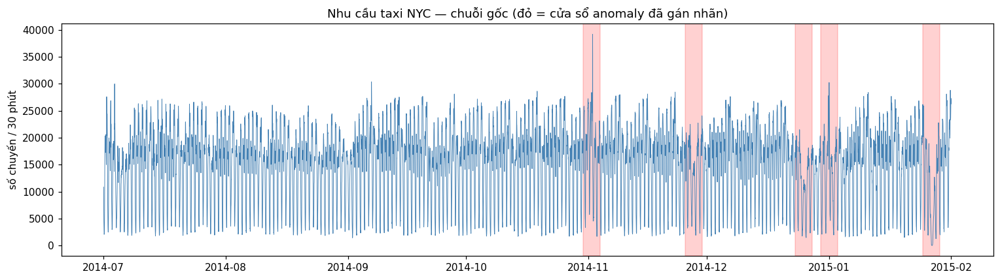
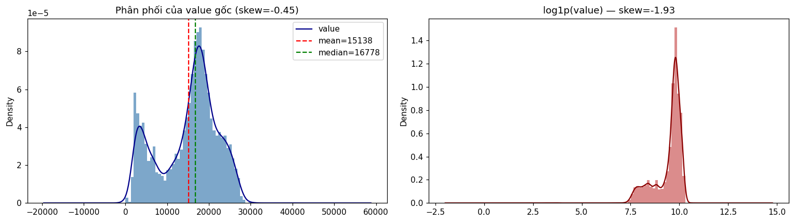
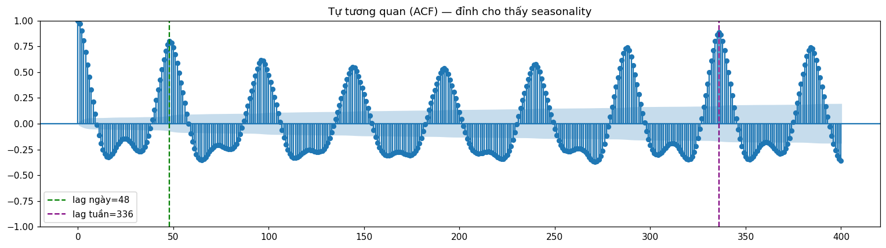
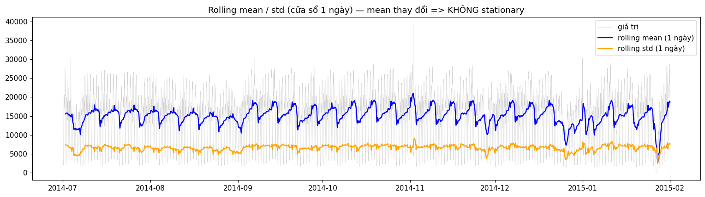
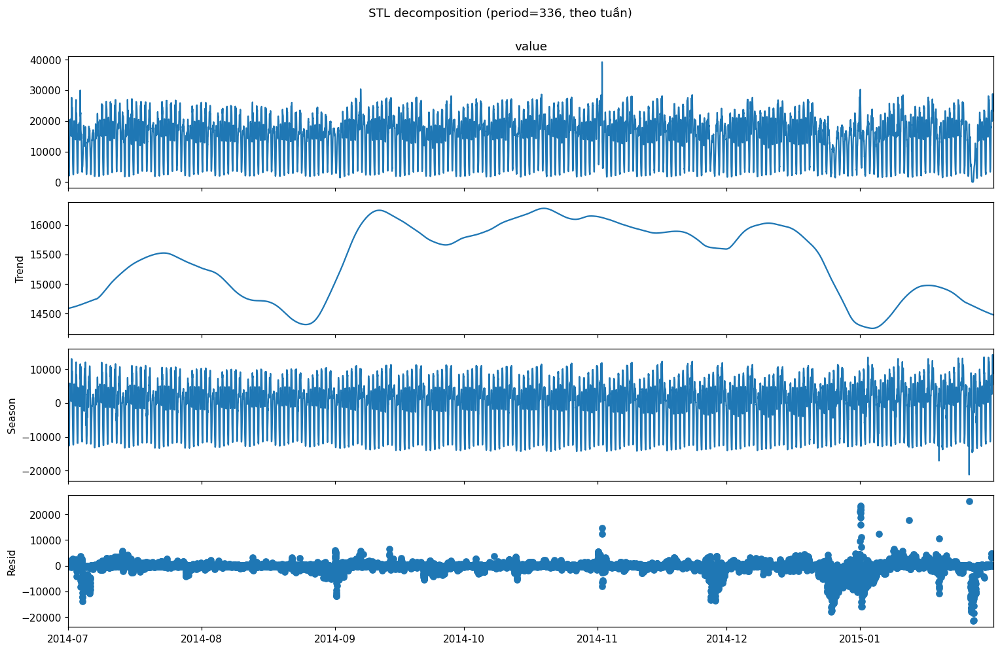
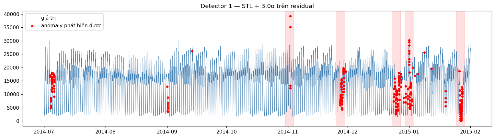
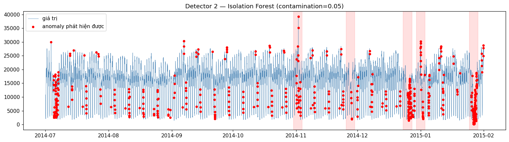
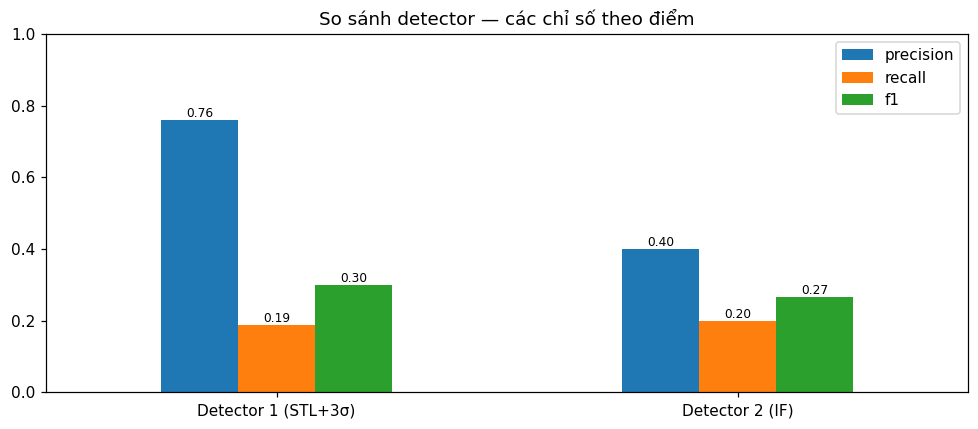
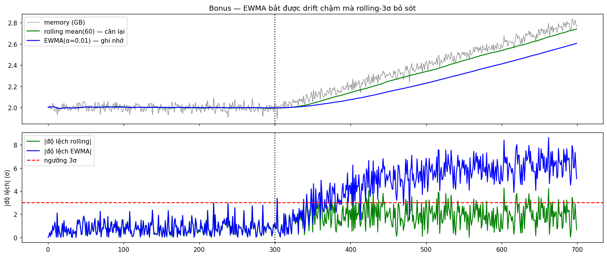

# W1-D1: Phát hiện Anomaly trên Metric 

**Dataset:** NAB `realKnownCause/nyc_taxi.csv` — nhu cầu taxi NYC, lấy mẫu mỗi 30 phút,
2014-07-01 → 2015-01-31 (10,320 điểm). Chọn vì có sẵn **cửa sổ anomaly gán nhãn
ground-truth** (5 sự kiện: NYC Marathon, Lễ Tạ ơn, Giáng sinh, Năm mới, bão tuyết cuối
tháng 1) và có seasonality ngày + tuần mạnh — hoàn hảo để cho thấy vì sao detector
statistical hiểu seasonal thắng 3σ ngây thơ.

- Notebook: [`assignment.ipynb`](assignment.ipynb) (bản mirror nguồn: `assignment.py`)
- Artifact model: [`models/isolation_forest.joblib`](models/isolation_forest.joblib) — **764 KB** (< 1 MB ✓)
- Hình: `figures/01..09_*.png`

---

## Phase 1 — EDA

### Chuỗi gốc (đỏ = cửa sổ anomaly đã gán nhãn)


### Thống kê cơ bản

| chỉ số | giá trị |
|---|---|
| mean | 15,137.6 |
| std | 6,939.5 |
| min / median / max | 8 / 16,778 / 39,197 |
| **skewness** | **−0.452** (lệch trái nhẹ, gần Gaussian) |
| kurtosis | −0.780 |

### Phân phối & kiểm tra log


`skew(gốc) = −0.452` → `skew(log1p) = −1.927`. Data lệch **trái** nhẹ, nên log-transform
làm skew **xấu hơn** — log là sai công cụ ở đây (nó chỉ sửa lệch *phải*). |skew| < 0.5 ⇒
phân phối biên đủ gần Gaussian.

### Tự tương quan (seasonality)


`ACF @ lag ngày 48 = 0.799`, `ACF @ lag tuần 336 = 0.887` → **seasonality ngày VÀ tuần
mạnh**. Tuần (336) là chu kỳ đơn rộng nhất và bao trùm chu kỳ ngày, nên dùng làm period
cho STL.

### Stationarity


Rolling mean theo cửa sổ 1 ngày thay đổi theo giờ/thứ ⇒ **không stationary** (seasonal).

### Kết luận Phase 1

| Tính chất | Phát hiện |
|---|---|
| Phân phối | lệch trái nhẹ, gần Gaussian (skew ≈ −0.45) |
| Log-transform | không phù hợp (làm skew xấu hơn) |
| Seasonality | ngày (48) + tuần (336) mạnh |
| Stationarity | không stationary (seasonal) |

**Chọn phương pháp:** seasonal + non-stationary ⇒ một band global 3σ duy nhất thất bại
(xem baseline bên dưới). Detector statistical đúng là **STL decomposition + 3σ trên
residual**; detector ML là **Isolation Forest trên các feature thời gian đã engineer**.

---

## Phase 2 — Các Detector

> Nhãn NAB là các **cửa sổ** 4 ngày (~10% tổng số điểm), trong khi detector flag những
> điểm lệch sắc nhọn. Nên **recall theo điểm vốn dĩ thấp** — vì vậy tôi báo cáo thêm
> **mức phát hiện theo sự kiện** (bao nhiêu trong 5 sự kiện đã biết có ≥1 flag).

### Baseline (lý do) — global 3σ thất bại

```
Band global 3σ = [-5681, 35956]   (data min=8, max=39197)
-> P=1.000  R=0.001  F1=0.002  sự kiện=1/5
```
Dao động seasonal làm phồng std global tới mức band **rộng hơn cả data** và cận dưới
**âm (vô nghĩa)**. Nó chỉ bắt được đúng 1 đỉnh Năm mới cao nhất và bỏ sót mọi đợt tụt
ngày lễ → cần STL.

### Detector 1 — STL + 3σ (statistical)
STL decomposition (period = 336 theo tuần, `robust=True`):


3σ trên residual:


```
STL + 3.0σ:  TP=194  FP=61  FN=841  P=0.761  R=0.187  F1=0.301  FAR=0.0066  sự kiện=5/5
```

### Detector 2 — Isolation Forest (ML)
**11 feature đã engineer:** `value, rolling_mean_1d, rolling_std_1d, rate_of_change,
rate_of_change_1d, lag_1, lag_1d, hour, dayofweek, is_weekend, z_score`.

**Log tuning contamination (yêu cầu Phase 2):**

```
=== Quét contamination cho Isolation Forest ===
contamination=0.01:  P=0.825  R=0.082  F1=0.149  FP=18   sự kiện=4/5
contamination=0.02:  P=0.602  R=0.120  F1=0.200  FP=82   sự kiện=4/5
contamination=0.05:  P=0.399  R=0.198  F1=0.265  FP=309  sự kiện=5/5
-> contamination được chọn = 0.05 (F1 tốt nhất)
```



```
Detector 2 (IF, c=0.05):  TP=205  FP=309  FN=830  P=0.399  R=0.198  F1=0.265  sự kiện=5/5
```

---

## Phase 3 — So sánh, Tuning & Reflection

### Bảng so sánh (theo điểm, cùng index)


| Chỉ số | Detector 1 (STL+3σ) | Detector 2 (IF, c=0.05) |
|---|---|---|
| Precision | **0.761** | 0.399 |
| Recall | 0.187 | **0.198** |
| F1 | **0.301** | 0.265 |
| False Alarms (FP) | **61** | 309 |
| False-alarm rate | **0.0066** | 0.0335 |
| Sự kiện bắt được | **5/5** | **5/5** |

**STL thắng** ở precision, F1, và false-alarm rate; cả hai đều bắt đủ 5 sự cố thật.

### Log tuning (≥3 lần chạy)

```
detector   param                precision  recall   f1     FP   sự kiện
STL        threshold=2.5        0.701      0.224    0.340  99   5/5
STL        threshold=3.0        0.761      0.187    0.301  61   5/5
STL        threshold=3.5        0.770      0.156    0.259  48   5/5
IF         contamination=0.01   0.825      0.082    0.149  18   4/5
IF         contamination=0.02   0.602      0.120    0.200  82   4/5
IF         contamination=0.05   0.399      0.198    0.265  309  5/5
```

Đánh đổi rõ ràng: hạ threshold STL (3.5→2.5) hoặc tăng contamination IF (0.01→0.05)
**đổi lấy recall bằng cái giá precision / nhiều false alarm hơn** — đúng cái dial
recall-vs-precision ở §9 của bài học.

### Artifact model
`models/isolation_forest.joblib` (joblib, `compress=3`) — **764.4 KB** < 1 MB ✓.

### Reflection
- **Loại data:** seasonal (ngày+tuần), non-stationary, lệch trái nhẹ → không phải ứng
  viên log-transform.
- **Vì sao các phương pháp này:** seasonality giết chết 3σ tĩnh (band rộng hơn data);
  **STL+3σ** bỏ cấu trúc ngày/tuần và chấm điểm residual → precision cao nhất và giải
  thích được cho đội ops. **Isolation Forest** trên feature thời gian đánh đổi precision
  để có núm recall điều chỉnh được và tổng quát hóa sang multivariate.
- **Cái nào tốt hơn / đánh đổi:** theo F1 theo điểm và false-alarm rate thì **STL thắng**
  và dễ giải thích hơn nhiều; IF cần feature engineering + `contamination` đã tune và là
  "hộp đen", nhưng scale được lên *nhiều metric tương quan* cùng lúc — điều STL không làm
  được. Recall theo điểm thấp với cả hai vì nhãn là cửa sổ 4 ngày trong khi sự kiện sắc
  nhọn — ở **mức sự kiện cả hai bắt 5/5**, đây mới là cái quan trọng cho paging.
- **Lựa chọn production:** STL+3σ (hoặc seasonal-ESD) làm **first-pass** thiên recall cho
  từng metric, Isolation Forest làm bộ lọc **multivariate second-pass**. Thiên về recall —
  bỏ sót một outage tốn kém hơn nhiều so với một báo nhầm bị dismiss.

---

## Bonus

### 1) EWMA(α=0.1) — detector drift, không phải detector spike seasonal


```
EWMA(α=0.1) trên taxi gốc:  P=0  R=0  sự kiện=0/5   (std giãn nở hấp thụ dao động seasonal -> sai công cụ)

Memory leak giả lập (drift từ t=300), trung bình |độ lệch| ở vùng drift ổn định:
  rolling-mean(60): 1.96σ  (dưới 3σ -> BỎ SÓT rò rỉ)
  EWMA(α=0.01):     6.08σ  (trên 3σ  -> BẮT ĐƯỢC rò rỉ)
```
Trí nhớ mũ dài của EWMA cứ tụt lại sau một drift chậm nên độ lệch lớn dần; rolling window
tự căn lại theo data đã trôi và mù tịt. EWMA tỏa sáng với drift kiểu memory-leak, **không**
phải data seasonal.

### 2) Log-transform — tùy vào DẤU của skew
```
nyc_taxi (lệch TRÁI):  skew -0.452 -> log1p -1.927   (log làm XẤU hơn -> không nên dùng)

Latency giả lập (lệch PHẢI):  skew 3.07 -> log1p 0.21
  band 3σ thô = [-52, 179]   (cận dưới âm = latency vô nghĩa)
  3σ thô :  P=0.375  R=0.80  F1=0.511  FP=20
  3σ log :  P=0.600  R=0.40  F1=0.480  FP=4
```
Trên latency lệch phải, log chuẩn hóa đuôi nặng → **cắt false alarm (FP 20→4, precision
0.38→0.60)** và bỏ cận dưới âm vô nghĩa; đổi lại mất chút recall do nén spike. **Luôn kiểm
tra dấu skew trước khi transform.**

### 3) Isolation Forest univariate vs multivariate
```
IF univariate (chỉ value):  P=0.157  R=0.077  F1=0.103  FP=431  sự kiện=5/5
IF multivariate (11 feat):  P=0.399  R=0.198  F1=0.265  FP=309  sự kiện=5/5
```
Thêm feature thời gian/ngữ cảnh giúp IF đánh giá **độ lệch so với ngữ cảnh seasonal**
(giờ, thứ trong tuần, độ lệch so với trend) thay vì độ lớn thô — precision tăng hơn gấp đôi.

---


