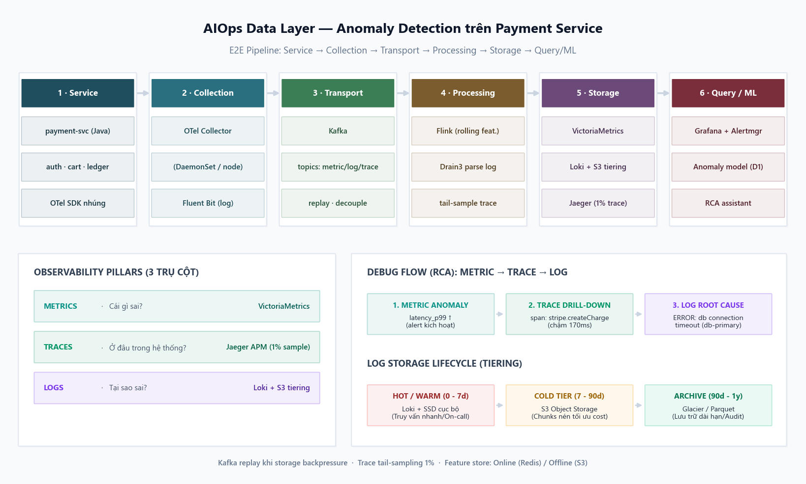
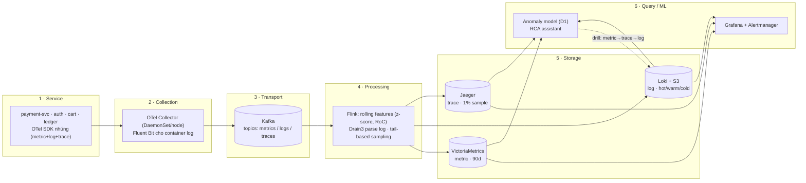

# Architecture — AIOps Data Layer cho Payment Service

**Use case:** *Anomaly detection trên payment-service* — một dịch vụ thanh toán
xử lý ~3.000 req/s ở giờ cao điểm. Mục tiêu của data layer: đưa được tín hiệu
**metric → trace → log** về một chỗ đủ nhanh (TTD < 1 phút) và đủ rẻ (giữ 30–90
ngày) để model bất thường ở W1-D1 và log-miner ở W1-D2 có data mà chạy.



> PNG sinh tự động bằng `uv run python gen_architecture.py`. Bản mermaid bên dưới
> render trực tiếp trên GitHub.



---

## Tool choice theo từng stage (và **tại sao**)

| Stage | Tool đã chọn | Tại sao chọn | Bỏ qua lựa chọn nào |
|---|---|---|---|
| **1 · Service** | **OpenTelemetry SDK** | 1 SDK cho cả 3 pillar, vendor-neutral → đổi backend không phải sửa code service; payment-svc (Java) instrument 1 lần. | Logback/Micrometer/Zipkin riêng lẻ → 3 SDK rời, khó thống nhất. |
| **2 · Collection** | **OTel Collector** (DaemonSet) + **Fluent Bit** (log) | Collector gom metric+trace per-node, enrich (k8s labels, geo từ IP); Fluent Bit ~450KB RAM hợp DaemonSet tail container log. | Fluentd (Ruby, nặng hơn) để ở aggregator; agent push thẳng → mất chuẩn hoá. |
| **3 · Transport** | **Kafka** | 50+ service, ~3K rps peak → cần buffer + **replay** khi storage backpressure; 1 stream feed đồng thời VM/Loki/ES + ML pipeline (multi-consumer). | Direct push (mất data khi DB down — xem [ADR-001](ADR-001.md)); NATS (không persist mặc định). |
| **4 · Processing** | **Flink** (+ Drain3) | Stateful streaming, exactly-once; tính rolling-window feature cho anomaly model real-time; correlate metric-spike ↔ log-spike (stream join). Drain3 parse log như W1-D2. | Spark Streaming (latency cao hơn); chỉ recording rules (không join được cross-signal). |
| **5 · Storage** | **VictoriaMetrics** (metric) · **Loki + S3** (log) · **Jaeger** (trace) | Mỗi pillar 1 store tối ưu: VM nén ~1 byte/sample, retention nhiều tháng; Loki index *labels* → rẻ ~8–10× ES (xem [ADR-001](ADR-001.md)); Jaeger + tail-sample 1% để trace không nổ chi phí. | Prometheus đơn-node (HA kém retention dài); Elasticsearch (đắt RAM-heavy); 100% trace sampling. |
| **6 · Query / ML** | **Grafana + Alertmanager** + **anomaly model (D1)** + **RCA assistant** | Grafana 1 UI cho cả 3 store; Alertmanager route paging; model D1 (STL/IsolationForest) đọc feature từ Parquet; RCA assistant chạy đúng flow metric→trace→log. | Datadog UI (lock-in, xem reflection ở SUBMIT). |

---

## Debug flow — *metric → trace → log* (lý do cần cả 3 pillar)

```
1. METRIC  : latency_p99{service=payment} ↑  → anomaly model flag (|z| > 3)   ← "CÁI GÌ sai"
2. TRACE   : drill 1 trace mẫu của /checkout → span chậm = stripe.createCharge 170ms  ← "Ở ĐÂU"
3. LOG     : mở log payment-svc quanh trace_id → ERROR "connection timeout db-primary"  ← "TẠI SAO"
```

Đây chính là pattern cross-signal đã demo ở W1-D1 (metric "cái gì") và W1-D2
(log "tại sao"); trace nối hai đầu bằng cách chỉ ra **service/span** nào để khoanh
vùng log — rút TTD từ "có sự cố" xuống "biết sửa ở đâu".

## Storage tiering (HOT / WARM / COLD) — vì sao tiết kiệm ~75%

```
[0–7 ngày]    HOT   Loki index + SSD cache        query nhanh,  đắt   (đa số incident nằm ở đây)
[7–90 ngày]   WARM  Loki chunks @ S3 Standard     query OK,     vừa
[90d–1 năm]   COLD  Parquet @ S3 / Glacier        query chậm,   rẻ    (post-mortem, compliance)
```

Trace **tail-based sample 1%** (giữ 100% trace lỗi/chậm, drop phần "healthy") và
metric **downsample** second→minute sau 7 ngày để retention dài mà cost thấp.

## Data contract & feature store (khi scale lên)

- **Schema Registry** (Confluent, Protobuf): producer phải register schema trước khi
  push lên Kafka topic; consumer validate → tránh "team A đổi log field, pipeline B vỡ".
  Breaking change cần version bump + deprecation 90 ngày.
- **Feature store** (Feast): online (Redis, <100ms cho inference real-time) + offline
  (S3/Parquet cho training) — chỉ adopt khi >5 model dùng chung feature. Hiện tại
  `pipeline.py` đã ghi `features.parquet` = offline store tối giản; chưa cần Feast.

## Định cỡ & chi phí (use case này ≈ tier *Medium*)

~100 service-instances · ~500 GB log/ngày · ~1M metric eps · 10M trace/ngày (sample 1%).
Theo `cost_model.py`: **self-host ≈ $8.3K/tháng infra** (+1 SRE) vs **Datadog ≈ $32K/tháng**.
Chi tiết & 3 tier xem [SUBMIT.md](SUBMIT.md).
