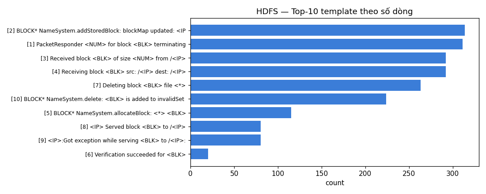
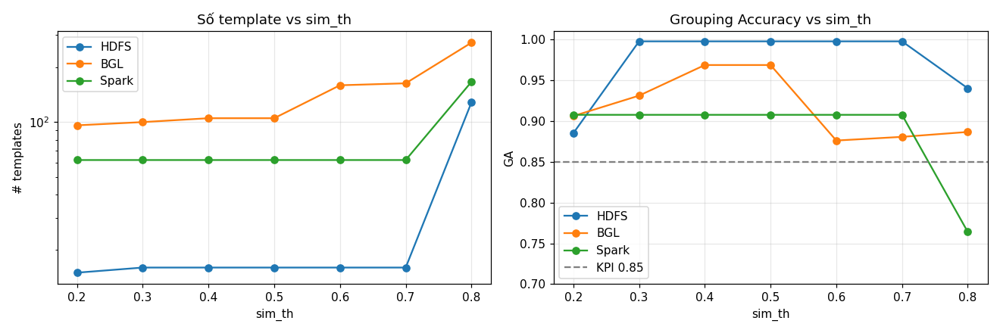
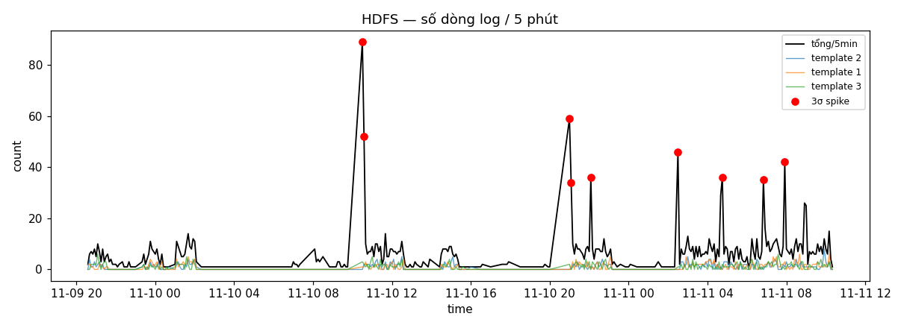
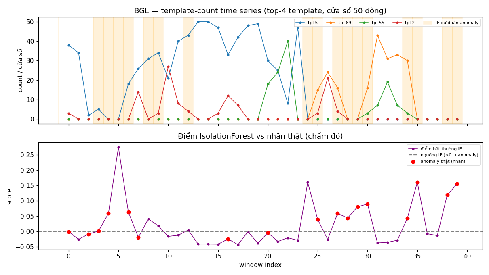
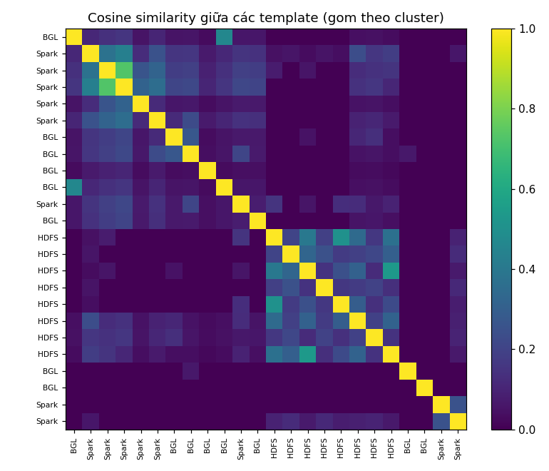

# W1-D2: Log Mining + Parsing + Anomaly từ Log


**Dataset:** mẫu chuẩn 2.000 dòng từ [Loghub](https://github.com/logpai/loghub) —
**HDFS**, **BGL**, **Spark** — kèm ground-truth template; riêng **BGL** có nhãn alert
trong từng dòng (cột `Label`, `-` = bình thường) dùng cho precision/recall.

---

## Phase 1 — Parse log với Drain3

**Cấu hình Drain3:** `sim_th=0.4`, `depth=4`, masking `DATE → IP → blk_ → HEX → ID → NUM`.
Nạp cột `Content` (đúng phần ground-truth được tạo ra) để đo Grouping Accuracy công bằng.

### Log output Drain3 (HDFS)
```
HDFS_2k.log: 2,000 dòng log thô
Số template ground-truth (EventId): 14
Drain3 tìm được 16 template (ground-truth: 14)
Grouping Accuracy = 0.9975   (KPI mục tiêu > 0.85)   
```

### Top-10 template (→ `results/top_templates.csv`)

| id | count | template |
|---:|---:|---|
| 2 | 314 | `BLOCK* NameSystem.addStoredBlock: blockMap updated: <IP> is added to <BLK> size <NUM>` |
| 1 | 311 | `PacketResponder <NUM> for block <BLK> terminating` |
| 3 | 292 | `Received block <BLK> of size <NUM> from /<IP>` |
| 4 | 292 | `Receiving block <BLK> src: /<IP> dest: /<IP>` |
| 7 | 263 | `Deleting block <BLK> file <*>` |
| 10 | 224 | `BLOCK* NameSystem.delete: <BLK> is added to invalidSet of <IP>` |
| 5 | 115 | `BLOCK* NameSystem.allocateBlock: <*> <BLK>` |
| 8 | 80 | `<IP> Served block <BLK> to /<IP>` |
| 9 | 80 | `<IP>:Got exception while serving <BLK> to /<IP>:` |
| 6 | 20 | `Verification succeeded for <BLK>` |



### Tuning log `drain_sim_th` (→ `results/simth_tuning.csv`)

| sim_th | HDFS #tpl | HDFS GA | BGL #tpl | BGL GA | Spark #tpl | Spark GA |
|---:|---:|---:|---:|---:|---:|---:|
| 0.2 | 15 | 0.8850 | 96 | 0.9060 | 62 | 0.9075 |
| 0.3 | 16 | **0.9975** | 100 | 0.9310 | 62 | 0.9075 |
| **0.4** | 16 | **0.9975** | 105 | **0.9685** | 62 | 0.9075 |
| 0.5 | 16 | 0.9975 | 105 | 0.9685 | 62 | 0.9075 |
| 0.6 | 16 | 0.9975 | 159 | 0.8760 | 62 | 0.9075 |
| 0.7 | 16 | 0.9975 | 163 | 0.8805 | 62 | 0.9075 |
| 0.8 | 128 | 0.9400 | 272 | 0.8865 | 166 | 0.7640 |



**Đọc biểu đồ:**
- `sim_th` **quá thấp (0.2)** → gộp quá tay, GA tụt (HDFS 0.885).
- `sim_th` **quá cao (0.8)** → mỗi biến thể thành 1 template (HDFS 16→128, Spark 62→166), GA tụt.
- **BGL cho thấy đỉnh rõ ở 0.4–0.5** (GA 0.9685) — dataset này `sim_th` "đáng tiền" nhất.
- → **Chọn `sim_th = 0.4`**: GA > 0.85 ở cả 3 dataset, ổn định nhất.

---

## Phase 2 — Anomaly Detection trên Log

### 2A · HDFS — template-count time series theo thời gian thật (5 phút)
HDFS_2k trải **1 ngày 13h44**. Tổng dòng/5min: mean=6.6, std=8.7 → **9 cửa sổ vượt 3σ**.
3 template xuất hiện *muộn nhất* (ứng viên "hành vi mới") đều là lệnh `BLOCK* ask … delete/replicate`.



### 2B · BGL — phát hiện anomaly **có nhãn** (cửa sổ 50 dòng)
BGL_2k trải 213 ngày (rất thưa) → dùng **cửa sổ theo số dòng** (W=50) thay vì cửa sổ
thời gian. 2.000 dòng, **143 dòng alert (7.1%)**, 105 template → 40 cửa sổ, 17 cửa sổ có alert.

| detector | precision | recall | f1 | flagged |
|---|---:|---:|---:|---:|
| 3-sigma | 0.548 | **1.000** | 0.708 | 31 |
| IsolationForest | **0.706** | 0.706 | 0.706 | 17 |

**Anomaly driver** (template gắn ~100% với nhãn alert) — chính là *root cause*:
```
100% alert | ciod: Error reading message prefix on CioStream socket to <IP> ...
100% alert | data TLB error interrupt
100% alert | rts: kernel terminated for reason <NUM>
100% alert | ciod: Error reading message prefix after LOAD_MESSAGE on CioStream ...
100% alert | Error receiving packet on tree network, expecting type <NUM> ...
```



**Nhận xét:** 3σ *nhạy* (recall=1.0 nhưng precision thấp, báo nhầm nhiều); Isolation
Forest *cân bằng* hơn vì xét đồng thời mix nhiều template trong một cửa sổ (multivariate).

---

## Phase 3 — Embedding (TF-IDF) + New-template detection

### TF-IDF + cosine similarity + clustering
24 template (top mỗi dataset) → 5 cluster. **8 template HDFS gom gọn thành 1 cluster
riêng** (nghiệp vụ block), BGL/Spark phân tán hơn (message ngắn, generic).



### Inject log "lạ" → new-template detection
```
Dòng lạ      : Possible SQL injection detected: '; DROP TABLE users; -- from user admin
change_type  : cluster_created   (= template MỚI!)
số cluster   : 16 → 17

Dòng quen    : PacketResponder 9 for block blk_1234567890 terminating
change_type  : none  → gộp vào template [1] đã có
```
→ Drain3 phát hiện **ngay lập tức** dòng chưa từng thấy bằng `change_type == "cluster_created"`.

---

## Cross-signal — Metric "cái gì", Log "tại sao"
Mô phỏng metric spike = cửa sổ BGL nhiều alert nhất (window 2, **47/50 dòng alert**) → mở log:
```
47 dòng | [10] data TLB error interrupt   <-- ALERT (root cause)
 2 dòng | [5]  generating core.<NUM>
 1 dòng | [3]  CE sym <NUM>, at <HEX>, mask <HEX>
```
→ TTD (time-to-detect root cause) ≈ tức thì: từ "có bất thường" → "vì `data TLB error`".

---

## Phase 4 — Mini log analyzer (`log_analyzer.py`)

`python log_analyzer.py <logfile> [--sim-th 0.4] [--windows 24]` — chạy trên file log
bất kỳ (tự dò timestamp HDFS/Spark/nginx/syslog/ISO/epoch; nếu không có thì dùng cửa sổ
theo vị trí dòng).

### So sánh 2+ dataset
| dataset | lines | templates | spiking | new |
|---|---:|---:|---:|---:|
| HDFS | 2000 | 14 | 3 | 2 |
| Spark | 2000 | 29 | 0 | 0 |
| BGL | 2000 | 82 | 4 | 10 |

**Tại sao khác nhau:** BGL (siêu máy tính, log kernel/hardware đủ loại) sinh **nhiều
template nhất**; HDFS chỉ vài loại sự kiện block lặp lại nên **ít template nhất**. Số
template tỉ lệ với độ đa dạng của thành phần/sự kiện trong hệ thống.

### Ví dụ output (HDFS, rút gọn)
```
Total log lines      : 2,000
Unique templates     : 14
Windowing            : time (6h)  (7 non-empty windows)
TOP 5 TEMPLATES
1. [   314   15.7%]  <NUM> INFO dfs.FSNamesystem: BLOCK* NameSystem.addStoredBlock ...
2. [   311   15.6%]  <NUM> INFO dfs.DataNode$PacketResponder: PacketResponder <NUM> ...
SPIKING TEMPLATES in time window starting 2008-11-11 06:00:00 (freq=6h)
  recent=92  avg=36.5  z=3.7  | ... PacketResponder ...
NEW TEMPLATES (first seen in the most-recent window)
  count=2 | ... BLOCK* ask <IP> to delete <BLK> ...
```

---

## KPI — đối chiếu mục tiêu

| KPI | Mục tiêu | Đạt được |
|---|---|---|
| Parsing accuracy (Grouping Accuracy) | > 0.85 | HDFS **0.9975**, BGL 0.9685, Spark 0.9075 |
| Template count / dataset | hợp lý, không quá ít/nhiều | 14 / 82 / 29 (raw) — hợp lý |
| Anomaly detection F1 (BGL có nhãn) | định lượng được | 3σ 0.708 · IForest 0.706 |
| Cross-signal TTD | < 5 phút | tức thì (demo) |

---

## Reflection

**1. Drain3 parse có tốt không?**
Rất tốt với log có cấu trúc: Grouping Accuracy 0.9975 trên HDFS, 0.9685 trên BGL — vượt
xa KPI 0.85, parse 2.000 dòng trong < 1 giây. Điểm mấu chốt là **masking**: nếu không che
`blk_`, IP, số, ngày trước, các token động đó sẽ phá cấu trúc cây và đẻ ra hàng trăm
template rác. Drain cũng *không hoàn hảo*: ở `sim_th=0.4` có vài dòng hiếm bị gộp thành
template quá tổng quát (`<NUM> INFO <*> <*> <*> <*> <BLK>`) — đánh đổi cố hữu của
fixed-depth tree.

**2. Template nào cho insight?**
- **Đếm nhiều** (HDFS top-10) → biết hệ thống đang *làm gì* (chủ yếu add/receive/delete block).
- **Gắn với nhãn alert** (BGL: `ciod Error`, `data TLB error`, `kernel terminated`) → đây
  mới là template *đáng báo động*, là root cause. Tần suất cao ≠ nguy hiểm; điều quan trọng
  là template nào **spike bất thường** hoặc **mới xuất hiện**.
- **Template mới** (SQL injection inject) → tín hiệu mạnh nhất cho hành vi lạ/tấn công/deploy lỗi.

**3. Metric vs Log khác gì?**
- **Metric** (D1): time series số (CPU, latency, error rate) → trả lời **"CÁI GÌ đang sai"**
  (latency tăng), phát hiện nhanh nhưng không nói *tại sao*.
- **Log** (D2): text từng sự kiện → sau khi parse thành template + đếm/embedding, trả lời
  **"TẠI SAO"** (vì `data TLB error` / `connection timeout`).
- **Kết hợp (cross-signal):** metric khoanh *thời điểm* → log khoanh *nguyên nhân*. Đó là
  lý do AIOps cần cả hai: rút ngắn TTD từ "biết có sự cố" tới "biết sửa ở đâu".

**Hạn chế & hướng mở rộng:** dùng mẫu 2.000 dòng (không phải TB-scale) nên template count
chưa chạm mức 100–500/service như production; pipeline đã viết *không phụ thuộc kích thước*,
chỉ cần trỏ `log_analyzer.py` / notebook vào HDFS_v1 đầy đủ (11M dòng + nhãn block-level) để
ra precision/recall ở quy mô thật. Có thể nâng cấp embedding sang sentence-transformers để
hiểu ngữ nghĩa (`timeout` ~ `refused`) thay vì chỉ từ vựng như TF-IDF.

> Trả lời 5 câu **Knowledge Check** ở `KNOWLEDGE_CHECK.md`.
